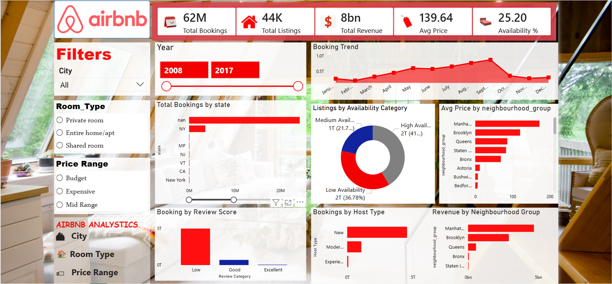

🏠 Airbnb Data Analytics: Demand, Pricing & Revenue Insights
________________________________________
📌 Short Description & Purpose
This project focuses on performing end-to-end data analysis on Airbnb listing data to uncover meaningful insights related to booking trends, pricing strategies, customer preferences, and revenue distribution.
The purpose of this project is to transform raw data into actionable business insights that help in understanding demand patterns, optimizing pricing strategies, and improving overall booking performance.
________________________________________
🛠️ Tech Stack / Tools Used
•	Python (Pandas) – Data cleaning, preprocessing, and feature engineering 
•	SQL – Data querying and extracting insights 
•	Power BI – Dashboard creation and data visualization 
•	Power Query – Data transformation 
•	DAX – Calculated columns, measures, and KPIs 
•	Excel / CSV – Data source 
________________________________________
📂 Data Source
•	The dataset used in this project is sourced from Kaggle, a widely used platform for data science and analytics projects. 
•	It contains Airbnb listing data, including details such as pricing, location, availability, reviews, and host information.
•	Source: Kaggle Airbnb Dataset 👉 https://www.kaggle.com/datasets/peterzhou/airbnb-open-data-in-nyc
________________________________________
⭐ Features / Highlights
•	Interactive dashboard with filters (City, Room Type, Price Range) 
•	KPI cards for Total Bookings, Revenue, Listings, Avg Price, and Availability 
•	Analysis of booking trends and seasonality 
•	Categorization of price range, availability, demand, and host types 
•	Visualization of revenue and booking distribution across locations 
•	Data cleaning and transformation using Python and Power Query 
________________________________________
❗ Business Problem
Airbnb platforms generate large volumes of listing data, but without proper analysis, it becomes difficult to identify:
•	Which locations generate maximum revenue 
•	What pricing strategies attract more customers 
•	How availability impacts demand 
•	Which hosts and listing types perform better 
This project addresses these challenges by converting raw data into meaningful insights for better decision-making.
________________________________________
🎯 Goals of the Dashboard
•	Identify high-demand locations and their impact on revenue 
•	Analyze pricing strategies and customer preferences 
•	Understand availability patterns and booking behavior 
•	Evaluate host performance and listing effectiveness 
•	Discover seasonal trends in bookings 
________________________________________
📊 Walkthrough of Key Insights
📍 Location-Based Insights
• Booking activity is concentrated in prime locations like New York and Brooklyn, indicating higher demand and popularity compared to other boroughs.
• Location analysis reveals significant data quality issues, where inconsistent naming (case differences, extra spaces, duplicates) leads to inaccurate demand classification, highlighting the need for data cleaning before analysis.
💰 Pricing-Based Insights
• Analysis shows that mid-priced listings generate the highest bookings, indicating strong customer preference for moderately priced accommodations.
• High demand locations have a higher average price (~140) compared to low demand locations (~100), indicating that higher-priced listings tend to receive more bookings.
• Expensive listings have slightly higher booking activity than budget listings, indicating strong demand even at higher price levels.
📅 Availability & Demand Insights
• High demand listings have significantly lower availability than low demand listings.
⭐ Reviews & Ratings Insights
• High rated listings receive more bookings than low rated listings.
• Highly reviewed listings prioritize occupancy over pricing, while low-reviewed listings tend to be overpriced with lower demand.
🏠 Room Type Insights
• Customers prefer affordable private rooms for higher bookings, while entire homes cater to premium users with higher pricing but slightly lower demand.
👤 Host Behavior Insights
• Experienced hosts with multiple listings attract more bookings, likely due to better management, visibility, and customer trust.
📊 Seasonal Trends Insights
• Airbnb demand shows clear seasonality, with peak bookings during late summer months, likely driven by vacations and travel trends, while early-year months experience lower demand.
💸 Revenue Insights
• Revenue is heavily concentrated in prime locations like New York and Brooklyn, highlighting higher demand and pricing power in these areas compared to other boroughs.
________________________________________
💼 Business Impact & Insights
•	Enables identification of high-performing locations for revenue optimization 
•	Helps in setting competitive and demand-driven pricing strategies 
•	Provides insights into customer preferences and booking behavior 
•	Assists in improving listing availability and occupancy rates 
•	Supports decision-making for host performance and platform growth 
________________________________________
🔑 Key Points
•	End-to-end data analysis project using Python, SQL, and Power BI 
•	Strong focus on business-driven insights and storytelling 
•	Cleaned and transformed raw data for accurate analysis 
•	Built an interactive and user-friendly dashboard 
•	Derived actionable insights for demand, pricing, and revenue optimization
________________________________________
📸 Dashboard Preview 

  

